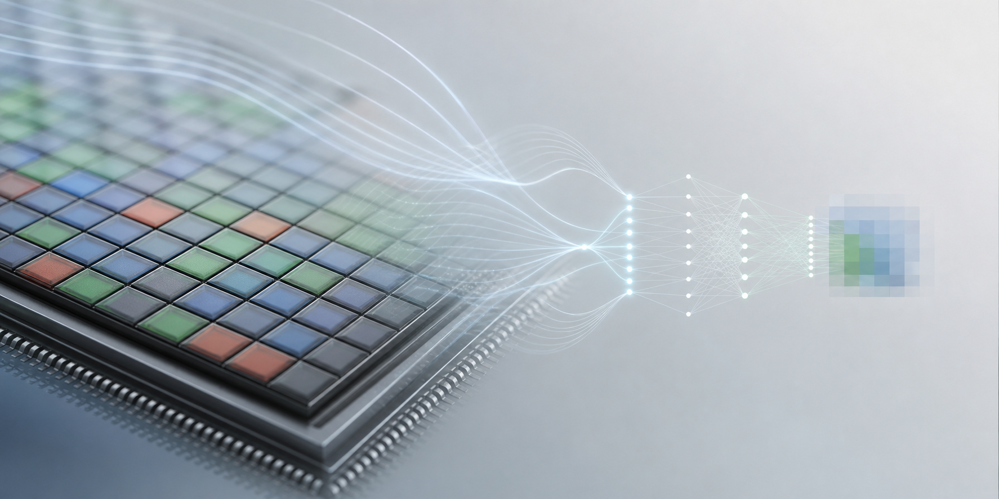

::: {.profile-page}

:::: {.hero}

::: {.hero-copy}
::: {.eyebrow}
Image Sensor R&D / AI Signal Processing / Computational Imaging
:::

# Teppei Kurita {#hero-title}

::: {.hero-lead}
R&D engineer working at the intersection of image sensors, AI signal processing, and computational imaging.
:::

::: {.hero-actions aria-label="Primary links"}
[Contact](#contact){.button .primary .no-external} [Profiles](#links){.button .secondary .no-external}
:::
:::

::: {.hero-media}
{fig-alt="Abstract image sensor and AI signal processing visual"}
:::

::::

:::: {#about .content-section}
::: {.section-kicker}
About
:::

## Research and engineering for real imaging systems

I am an R&D engineer working on image sensor signal processing, AI-based imaging, and computational imaging. My work focuses on practical imaging systems, lightweight neural networks, RAW image processing, and real-world constraints in image sensor pipelines.

I also have experience in academic community activities and industry relations in computer vision and image processing, including Visiting Researcher experience at UCLA.
::::

:::: {#highlights .content-section}
::: {.section-kicker}
Highlights
:::

## Profile Highlights

:::: {.card-grid}
::: {.info-card}
### Image sensor R&D

Signal processing for sensor pipelines, RAW data, and practical camera systems.
:::

::: {.info-card}
### AI-based signal processing

Learning-based imaging methods designed with efficiency and deployment constraints in mind.
:::

::: {.info-card}
### Computational imaging

Algorithms that combine optics, sensing, reconstruction, and downstream perception.
:::

::: {.info-card}
### Computational Imaging input

Assisted with polarization imaging content for [Computational Imaging](https://imagingtext.github.io/) (MIT Press, 2022); acknowledged in related materials.
:::

::: {.info-card}
### Practical imaging systems

Experience connecting imaging algorithms with real-world sensor constraints.
:::

::: {.info-card}
### Competition results

Recognized results in Kaggle and CVPR Workshop imaging challenges.
:::

::: {.info-card}
### Public research outputs

Multiple peer-reviewed results at leading computer vision venues; details are available on Google Scholar.
:::

::: {.info-card}
### Patent record

Dozens of public patent records in imaging and signal processing; details are available on Google Patents.
:::

::: {.info-card}
### Academic and industry relations

Community activity across computer vision, image processing, and industry relations.
:::
::::
::::

:::: {#expertise .content-section}
::: {.section-kicker}
Expertise
:::

## Technical Focus

::: {.tag-list aria-label="Expertise areas"}
- Sensor-aware computational imaging
- Image sensor signal processing
- RAW / sensor-domain imaging
- Polarization imaging and sparse sensing
- Dual-pixel depth estimation
- Physics-informed lightweight models
- Low-light image enhancement
- Image restoration and reconstruction
- Practical camera pipelines
- Edge AI / on-device inference
:::
::::

:::: {#competitions .content-section .split-section}
::: {.section-intro}
::: {.section-kicker}
Selected Competition Results
:::

## Measurable results in imaging and AI challenges
:::

::: {.result-list}
- **3rd Place**, [NTIRE 2026 Efficient Low Light Image Enhancement Challenge](https://openaccess.thecvf.com/CVPR2026_workshops/NTIRE), CVPR Workshop 2026
- **3rd Place / Gold Medal**, [RSNA 2024 Lumbar Spine Degenerative Classification](https://www.kaggle.com/competitions/rsna-2024-lumbar-spine-degenerative-classification), Kaggle
- **Kaggle Competitions Master**
:::
::::

:::: {#awards .content-section}
::: {.section-kicker}
Awards & Recognition
:::

## Awards across imaging, AI, and research communities

::: {.award-list}
- [Educational Merit Award](https://www.rsna.org/artificial-intelligence/ai-image-challenge/lumbar-spine-degenerative-classification-ai-challenge), RSNA Lumbar Spine Degenerative Classification AI Challenge, 2024
- [Takagi Award](https://ssii.jp/ssii/ssii_takagi.html), Symposium on Sensing via Image Information, 2021
- Audience Award, Symposium on Sensing via Image Information, 2018
- Best Academic Paper Award, Symposium on Sensing via Image Information, 2018
- Research Award, Game Programming Workshop, 2008
:::
::::

:::: {#activities .content-section .two-column}
::: {.section-intro}
::: {.section-kicker}
Professional Activities
:::

## Community

::: {.plain-list}
- Corporate Relations Vice Chair, [MIRU 2026](https://miru-committee.github.io/miru2026/en/)
- Steering Committee Member, [IPSJ SIG-CVIM](https://cvim.ipsj.or.jp/), Apr. 2021 – Mar. 2026
:::
:::

::: {.section-intro}
::: {.section-kicker}
Languages & Credentials
:::

## Additional profile

::: {.plain-list}
- Japanese: Native
- English: Business level
- Kaggle Competitions Master
- Real Estate Transaction Agent, Japan
:::
:::
::::

:::: {#links .content-section}
::: {.section-kicker}
Links
:::

## Profiles and Research Links

::: {.link-grid}
- [Google Scholar](https://scholar.google.com/citations?user=cFF-T_gAAAAJ)
- [Google Patents](https://patents.google.com/?inventor=teppei+kurita&oq=teppei+kurita)
- [Kaggle](https://www.kaggle.com/tpkuri)
- [GitHub](https://github.com/tkuri)
- [LinkedIn](https://www.linkedin.com/in/teppei-kurita-457409198)
- [ORCID](https://orcid.org/0000-0002-4537-3244)
- [researchmap](https://researchmap.jp/YOUR_RESEARCHMAP_ID)
:::
::::

:::: {#contact .content-section .contact-section}
::: {.section-kicker}
Contact
:::

## Professional inquiries

Please contact me via LinkedIn or one of the listed professional profiles.

[LinkedIn](https://www.linkedin.com/in/YOUR_LINKEDIN_ID){.button .primary}
::::

:::
